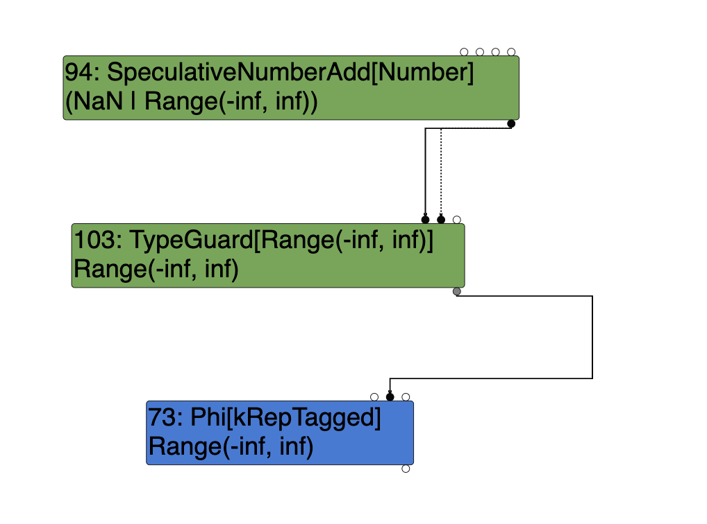

A SIGTRAP in TurboFan optimized code...! Thanks to X for the exploit.
I don't know this code very well -- to be honest, it's subtle complexity scares me.
So, I'll try to learn some things and share them.

--------

Here is our program. I've altered it slightly from the original exploit just to remove subsystems
that aren't part of the problem. I'm running with flags `--allow-natives-syntax` and `--nouse-osr`:

```javascript
function write(begin, end, step) {
  for (var i = begin; i >= end; i += step) {
    step = end - begin;
    begin >>>= 805306382;
  }
}

function bar() {
  for (let i = 0; i < 10000; i++) {
    write(Infinity, 1, 1);
  }
}

bar();
%OptimizeFunctionOnNextCall(bar);
bar();
```

What happens is that TurboFan optimizes function `write`, then `bar,` and it inlines `write` into `bar`.
A run with `--trace-opt` gives you this information. The mechanics of the loop are interesting. With
`begin` equal to Infinity, we come into the loop and set `step` to `-Infinity`. We set `begin` to `0`
thanks the to extreme right-shift operation. At the end of the loop, we increment `i` with the new
value of `step`, so `i = Infinity + -Infinity`. The addition of two infinitys of opposite sign produces
a `NaN`. Therefore, the loop condition `i >= end` fails, and we exit the loop.

Failing with a trap reveals an odd interrupt instruction just sitting there after we verify the stack
depth isn't too great. This confused me for a while, and I started painstakingly computing the value of
the stack limit in the isolate, wondering what was wrong, and so forth. Georg walked by on his way to
lunch, saw my mistake and casually mentioned that when TurboFan encounters impossible situations it'll
put an interrupt in the code. "So, there's nothing wrong with that stack limit code."

Okay, thanks! <muttering under breath that I should know that, grr>.

With Turbolizer, I can see the inner loop appear after the inlining phase. I notice that eventually
this loop no longer exists. Is TurboFan just really fancy and amazing, recognizing that the loop
can only run once? That would be cool...

I notice another thing: the Phi which represents the loop control variable `i` has a representation
of type `Tagged`, but after simplified lowering it's become type `None`. This is disturbing news.
In fact, as the phases go forward I see that this information gradually feeds through the graph
until Dead nodes are created, leading to the elimination of the loop itself. So how did this happen?

Let's look at the world from the point of view of this Phi after Escape Analysis.

<image src="images/phi-viewpoint.png"/>


The Phi has a type of `Range(-Inf, Inf)`. The `NumberAdd` operation is the result of `i += step`.
It makes sense that the type of NumberAdd is the union of `Range(-Inf, Inf)` and `NaN`, since
as we know, infinity + (-infinity) produces `NaN`. But there is a TypeGuard node that eliminates
the `NaN`. I need to understand what it does...is this just a renaming, or does it deopt?

In simplified lowering we end up with TypeOf(node) returning NONE for the Phi. How did it lose
it's interesting `Range(-inf, inf)` type?

1. Propagation Phase (phase PROPAGATE):

    visit #73: Phi (trunc: no-truncation (but identify zeros))
      queue #112?: no-value-use
      added: no-truncation (but identify zeros)
      queue #103?: no-value-use
      added: no-truncation (but identify zeros)
      queue #68?: no-value-use

    visit #73: Phi (trunc: no-truncation (but distinguish zeros))
      queue #112?: no-truncation (but identify zeros)
      added: no-truncation (but distinguish zeros)
      queue #103?: no-truncation (but identify zeros)
      added: no-truncation (but distinguish zeros)
      queue #68?: no-value-use

1. Type Propagation Phase (phase RETYPE):

     visit #73: Phi
      ==> output kMachNone


Another node, the TypeGuard (#112) comes from after the logical shift right operation, and it appears to end up with type None.
Isn't that a reason to pollute the Phi (#73) and make it have type None? The typeguard is protecting the constant `NaN`.
It tries to enforce a range of `-inf` to `inf`. Obviously it can't do that with `NaN`! So is this the point of contradiction?

Could it be that when we do loop peeling, we recognize that i will be NaN on the second iteration of the loop, and this
disturbs the TypeGuard, leading to contradiction?

After Loop peeling, the TypeGuard takes NumberAdd as input, and feeds output to the Phi. The TypeGuard node is typed
to `Range(-inf, inf)`. But it's input, the NumberAdd, is typed to `NaN | Range(-inf, inf)`.

<image src="images/guard-after-peeling.png"/>


We have the following interesting data about how the Add was replaced with the constant, and some of the propagation of effects:

    (from during the load elimination phase)
    - In-place update of 111: NumberSubtract(42, 58) by reducer TypeNarrowingReducer
    - Replacement of 111: NumberSubtract(42, 58) with 126: NumberConstant[-inf] by reducer ConstantFoldingReducer
    - In-place update of 110: NumberAdd(58, 126) by reducer TypeNarrowingReducer
    - Replacement of 110: NumberAdd(58, 126) with 127: NumberConstant[nan] by reducer ConstantFoldingReducer
    - In-place update of 112: TypeGuard[Range(-inf, inf)](127, 113, 115) by reducer TypeNarrowingReducer

Indeed, the type narrower correctly reduces the intersection of NaN and the range to no type. So what on earth should
we do now? This seems to be the source of the trouble. If we end up with a type guard that lost the type which it
purports to guarantee, how can we go on "living," so to speak? Should there be a general rule, that if a type narrowing
resulted in the empty set, we've gone horribly wrong and need to stop or backtrack?

Maybe the TypeGuard was invalid. That is, on what basis did it get inserted...why was there a decision that the NaN could
be successfully guarded against? Clearly, that attempt failed!

There was a node, #103, which was a typeguard. #112 was a copy of it made during loop peeling. Where did this one come from?
It was introduced in the typing phase.



In this phase we are running the LoopVariableOptimizer. The Typer accepts the LoopVariableOptimizer as a helper class which it uses.
The Typer runs with the induction variables being specially identified as `InductionVariablePhis`. I think something is going
wrong there. I think somehow the analysis isn't taking into account that there is a NaN in the type information for one
of the Phis inputs (the Add), and serenely decides on a range that it really shouldn't. Somehow, on first visit, the phi already
has a type of `Range(-inf, inf)`. How can that possibly be?


I tried updating the loop induction variable in the same way phis have their type determined, by unioning in the type of
all the input nodes. But this didn't change us from range (-inf, inf). Why not? Shouldn't the add have this? It seems that the
add might be updated in two stages.


Now this is where I have to pick up: How #94 SpeculativeNumberAdd is typed, and the way that typing interleaves with the loop
induction variable controlled by Phi #73.
