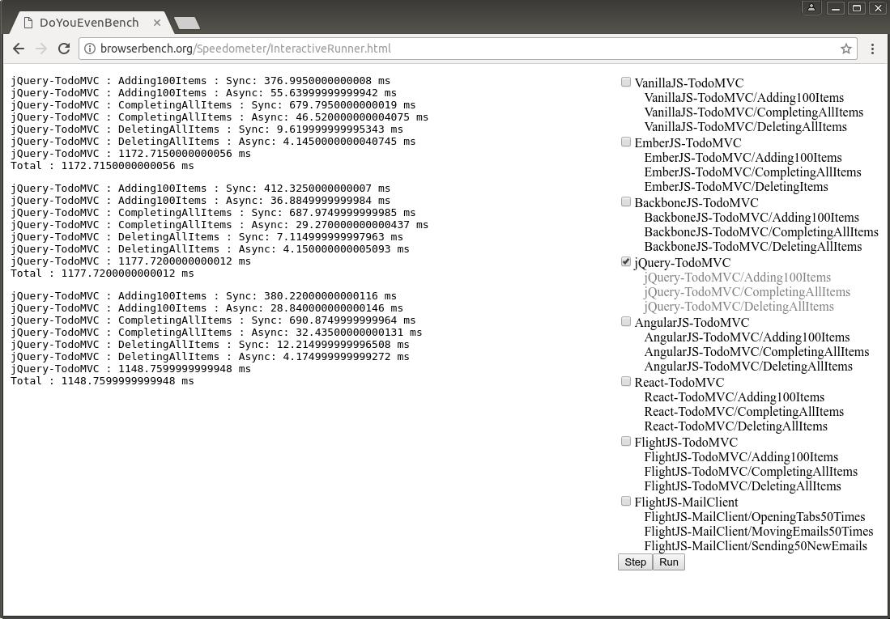
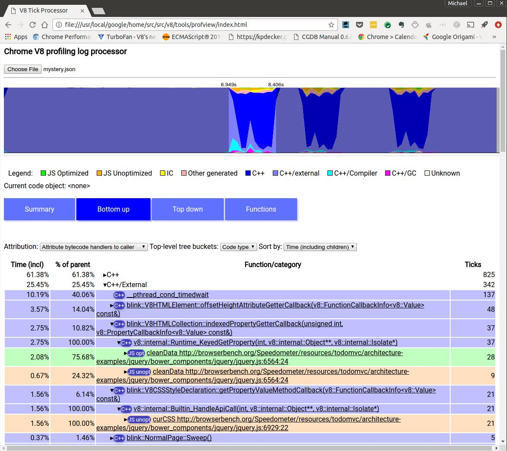
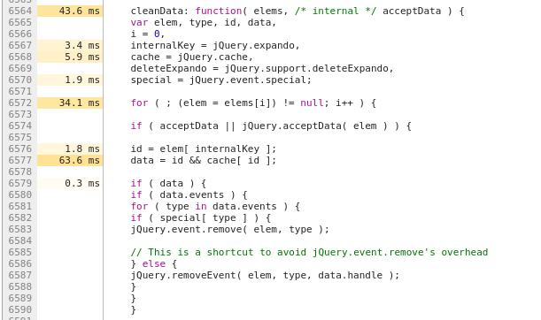

My marching orders today were:

    OPPORTUNITIES FOR SMALL IMPROVEMENT IN JQUERY SPEEDOMETER BNCHMRK. STOP.
    WHY CALLS TO RUNTIME KEYED LOAD? WHY CALLS TO HANDLEAPICALL? WHY? STOP.

These days I'm a manager type, more comfortable droning on in sonorous tones
with made up words like "leveraging" and "embiggen," but p'raps I can saddle
up and look at the code again.

----------

First! To use Jaro's new ProfView tool! (`v8/tools/profview/index.html`).
Hilariously, I was poking around in /tools and found `profviz`, an apparently
abandoned tool that Jaro didn't even know about. "As a manager, I encourage you
to leverage existing resources for maximum effect."

He just stared at me.

Okay! Back to work. First I run the Speedometer jQuery benchmark in chrome like
this:

    out/Release/chrome --no-sandbox --js-flags="--prof"

I have to use `--no-sandbox` so that an `isolate-v8.log` file can be written to disk.
And `--js-flags` is the place to pass V8 options.


<center><a href="images/interactiverunnger.jpg"></a></center>

I ran the test three times, shut Chrome down, then process the log file.
Oh jeez, there are four of them. Sigh. I'll try the first one. Running in the
chrome directory:

    v8/tools/linux-tick-processor --preprocess isolate-0x20c3d10ee000-v8.log >
        mystery.json

I load that file up in ProfView, and see the following:

<center><a href="images/profview1.jpg"></a></center>

The first issue is from the function `cleanData`, where a keyed load ends up in
the runtime both from an unoptimized version of `cleanData` and an optimized
version. Wha? Can't we do better? Adding insult to injury,
`Runtime_KeyedGetProperty` calls Blink's `indexedPropertyGetterCallback`.

    HEADQRTRS THOUGHT WE HAD A FAST PATH FOR THAT.
    STOP.

Here is the code:

```javascript
cleanData: function( elems, /* internal */ acceptData ) {
  var elem, type, id, data, i = 0,
    internalKey = jQuery.expando,
    cache = jQuery.cache,
    deleteExpando = jQuery.support.deleteExpando,
    special = jQuery.event.special;

  for ( ; (elem = elems[i]) != null; i++ ) {

    if ( acceptData || jQuery.acceptData( elem ) ) {
      id = elem[ internalKey ];
      data = id && cache[ id ];
      if ( data ) {
        if ( data.events ) {
           ...
```
 
Well, I see at least 3 keyed loads in the code above, and there are even more below.
Hmm, ProfView can't tell me *which* keyed load is the expensive one. I'll use Chrome
Developer Tools to take a snapshot of a run to try and get more hints...

<center><a href="images/devtools1.jpg"></a></center>

The line `data = id && cache[ id ]` gets most of the ticks. It's reasonable to conclude
this is the heaviest load. In fact though, it's the lightest.

Time to visit my old friend, `--trace-ic` and watch what happens to this keyed load ic.
Things have changed in the old neighborhood...the output no longer goes to the console, but
the log file. M'okay.

    v8/tools/ic-processor isolate-0x5acebee7000-v8.log > mystery-ic.txt

    $ cat mystery-ic.txt | grep KeyedLoadIC | grep cleanData
    KeyedLoadIC (0->1) at cleanData ../jquery.js:6572:27 0 (map 0x20d03abb5aa9)
    KeyedLoadIC (0->.) at cleanData ../jquery.js:6576:16 jQuery19101482418194915336 (map 0x20d03abcffc1)
    KeyedLoadIC (.->1) at cleanData ../jquery.js:6576:16 jQuery19101482418194915336 (map 0x20d03abb5529)
    KeyedLoadIC (1->N) at cleanData ../jquery.js:6576:16 jQuery19101482418194915336 (map 0x20d03abd0281)
    KeyedLoadIC (1->1) at cleanData ../jquery.js:6572:27 0 (map 0x20d03aba4121)
    KeyedLoadIC (1->N) at cleanData ../jquery.js:6572:27 1 (map 0x20d03aba4121)
    KeyedLoadIC (N->N) at cleanData ../jquery.js:6576:16 jQuery19101482418194915336 (map 0x20d03abcffc1)
    KeyedLoadIC (N->N) at cleanData ../jquery.js:6576:16 jQuery19101482418194915336 (map 0x20d03abd5191)
    KeyedLoadIC (N->N) at cleanData ../jquery.js:6576:16 jQuery19101482418194915336 (map 0x20d03abb55d9)
    KeyedLoadIC (N->N) at cleanData ../jquery.js:6576:16 jQuery19101482418194915336 (map 0x20d03abb62e9)
    KeyedLoadIC (N->N) at cleanData ../jquery.js:6576:16 jQuery19101482418194915336 (map 0x20d03abd53f9)
    KeyedLoadIC (0->1) at cleanData ../jquery.js:6577:25 14 (map 0x20d03aba2ee9)
    KeyedLoadIC (0->1) at cleanData ../jquery.js:6593:17 14 (map 0x20d03aba2ee9)
    KeyedLoadIC (N->N) at cleanData ../jquery.js:6576:16 jQuery19101482418194915336 (map 0x20d03abb55d9)
    KeyedLoadIC (N->N) at cleanData ../jquery.js:6576:16 jQuery19101482418194915336 (map 0x20d03abb62e9)
    KeyedLoadIC (N->N) at cleanData ../jquery.js:6576:16 jQuery19101482418194915336 (map 0x20d03abd53f9)
    KeyedLoadIC (N->N) at cleanData ../jquery.js:6576:16 jQuery19101482418194915336 (map 0x20d03abd0281)
    KeyedLoadIC (N->N) at cleanData ../jquery.js:6576:16 jQuery19101482418194915336 (map 0x20d03abcffc1)
    KeyedLoadIC (N->N) at cleanData ../jquery.js:6576:16 jQuery19101482418194915336 (map 0x20d03abb5529)
    ...

Hmm. It's sad to see that for loop with `elem = elems[i]` go generic. That's weird. I also notice that
I can't tell from this log output if the IC is in the optimized version of cleanData or the unoptimized
version. The old trace-ic logs used to display this.
[I'll just take care of that now, yallz](https://codereview.chromium.org/2835923004/).

Turning away from IC tracing for a moment, let's look at the optimized code for `cleanData`.

    out/Release/chrome --no-sandbox --js-flags="--trace-opt-code --trace-opt" > code.txt

Now I can look at the optimized code for `cleanData` and see when keyed load ICs are used.
At the risk (certainty!) of overbroad generalization, if we use an IC in optimized code it
*means we've given up trying to optimize it*. The code is
"generic" from our point of view. Hopefully we can do better from this point.

        -- B4 start (loop up to 160) --
    0x2e72378a7380   120  488b4dd8       REX.W movq rcx,[rbp-0x28]
    0x2e72378a7384   124  48c1e120       REX.W shlq rcx, 32
        -- ../jquery.js:6572:27 --
    0x2e72378a7388   128  488b75f8       REX.W movq rsi,[rbp-0x8]
    0x2e72378a738c   12c  488b5518       REX.W movq rdx,[rbp+0x18]
    0x2e72378a7390   130  48b8000000000e000000 REX.W movq rax,0xe00000000
    0x2e72378a739a   13a  4c8bc0         REX.W movq r8,rax
    0x2e72378a739d   13d  e89e8ef2ff     call 0x2e72377d0240  (KeyedLoadICTrampoline)
        ;; code: KEYED_LOAD_IC

Yuck, this is the for loop with `elem = elems[i]`. So sad that we are generic! I really want to know why.
I ran chrome with the debugger, first adjusting `gn args out\Debug` to include the key
`v8_optimized_debug = false` so I could inspect variables. I found the place in the IC system where we
update the IC state, using printf-style debugging to stop at the right place:

```cpp

// in src/ic/ic.cc:

void KeyedLoadIC::UpdateLoadElement(Handle<HeapObject> receiver) {
  ...

  if (strcmp("cleanData",
             GetHostFunction()->shared()->DebugName()->ToCString().get()) == 0) {
    PrintF("This is your stop.\n");
  }
  ...

```

[Debugging Chrome](https://chromium.googlesource.com/chromium/src/+/lkgr/docs/linux_debugging.md)
can be tricky, here is the command line I used:

    gdb --args out/Debug/chrome --disable-gpu --single-process --no-sandbox
        http://browserbench.org/Speedometer/InteractiveRunner.html

Setting a breakpoint on the `PrintF` statement, I first hit it when we went monomorphic.
Then we come in with a new map and stay monomorphic. On the third hit we go generic with
the message `same map added twice.` I could inspect the receiver and the feedback vector
with our friendly debugger helpers (available in `v8/tools/gdbinit`).

    (gdb) frame 2
    #2  0x00007f2a77e8a2d1 in v8::internal::__RT_impl_Runtime_KeyedLoadIC_Miss (args=...,
        isolate=0xe93d3eb9020) at ../../v8/src/ic/ic.cc:2439
    2439      RETURN_RESULT_OR_FAILURE(isolate, ic.Load(receiver, key));
    (gdb)

In this frame I can look at the input variables. The receiver:

    (gdb) job *receiver
    0x9cf0a77a209: [JSArray]
     - map = 0x3114690a4121 [FastProperties]
     - prototype = 0x3f6568a88141
     - elements = 0x9cf0a77a239 <FixedArray[1]> [FAST_ELEMENTS]
     - length = 1
     - properties = 0x61c9ec02241 <FixedArray[0]> {
        #length: 0x38b9c858c59 <AccessorInfo> (const accessor descriptor)
     }

Hmm, we have an elements store of length 1. What about our key?

    (gdb) p key
    $8 = {<v8::internal::HandleBase> = {location_ = 0x7f2a495e8920}, <No data fields>}
    (gdb) job *key
    Cannot access memory at address 0x100000000

Oh. The key is a Smi with the value 1. Sigh. We are looking at the array beyond the end. And a quick
glance at the KeyedLoadIC dispatcher shows that we MISS to the runtime in this case (this code is in
`AccessorAssembler::HandleLoadICSmiHandlerCase()`, I won't go into it here but it has a telling
line of code...`Label* out_of_bounds = miss;` LOL. This means out of bounds access results in a trip
to the runtime. So you see, v8 is not optimized to clever code like
`for ( ; (elem = elems[i]) != null; i++ ) {`).

I locally changed the code to look more old-fashioned because I wanted to see the KeyedLoadIC go away.

```javascript
cleanData: function( elems, /* internal */ acceptData ) {
  ...
  var len = elems.lenth;
  for ( ; i < len; i++ ) {
    elem = elems[i];
    ...
```

My change made the keyed load
run in polymorphic 2-degree state. Why wasn't this enough to emit optimized loads? Time to debug TurboFan. We have code
in `JSNativeContextSpecialization::ReduceElementAccess()` which builds the polymorphic loads
keying on the receiver map. I stepped into this...

A look at the feedback vector made me realize it wouldn't be so simple. One of the maps we had to
handle is an indexed interceptor.

    (gdb) jfv *nexus.vector_handle_
    0x5932c9d0ff1: [FeedbackVector]
     - length: 66
     Slot #0 LoadProperty MONOMORPHIC
     ...
     Slot #16 LoadKeyed POLYMORPHIC
      [18]: 0xfda86d07429 <FixedArray[4]>
      [19]: 0x1428fdb04e21 <Symbol: uninitialized_symbol>
     Slot #18 Call MONOMORPHIC
     ...
    (gdb) job 0xfda86d07429
    0xfda86d07429: [FixedArray]
     - map = 0xfca2f802309 <Map(FAST_HOLEY_ELEMENTS)>
     - length: 4
               0: 0x1ec5780083f9 <WeakCell value= 0x3ba1419a4121 <Map(FAST_ELEMENTS)>>
               1: 72
               2: 0x1ae5bf10de49 <WeakCell value= 0x3ba1419b5b01 <Map(FAST_HOLEY_SMI_ELEMENTS)>>
               3: 0x29f74c85261 <Code HANDLER>

What this means is that we have a polymorphic keyed load with smi-like keys (the uninitialized
symbol in `[19]` tells us this). The fixed array is a mapping of the receiver map to a handler.
Sometimes the handler is code, sometimes it's a smi telling us what to do. A look at the code
shows that it's the indexed interceptor handler:

    (gdb) jco 0x29f74c85261
    0x29f74c85261: [Code]
    kind = HANDLER
    major_key = LoadIndexedInterceptorStub
    compiler = turbofan
    Instructions (size = 92)
    ... (I removed some stuff) ...
    0x29f74c85318    38  48bb609731d0d17f0000 REX.W movq rbx,0x7fd1d0319760
        ;; external reference (Runtime::LoadElementWithInterceptor)
    0x29f74c85322    42  b802000000     movl rax,0x2
    0x29f74c85327    47  4889542410     REX.W movq [rsp+0x10],rdx
    0x29f74c8532c    4c  e9cff1dfff     jmp 0x29f74a84500 ;; code: STUB, CEntryStub, minor: 8
    // Call LoadElementWithInterceptor through the CEntryStub.

Back in `JSNativeContextSpecialization::ReduceElementAccess()`, I see the writing on the wall.
We only do fast handling of polymorphic keyed element loads if all the Maps are simple fast
element arrays. We call `AccessInfoFactory::ComputeElementAccessInfos()` which runs a test
on each Map that succinctly expresses what we consider reasonable to inline:

```cpp
bool CanInlineElementAccess(Handle<Map> map) {
  if (!map->IsJSObjectMap()) return false;
  if (map->is_access_check_needed()) return false;
  if (map->has_indexed_interceptor()) return false;  // Tears of a clown...
  ElementsKind const elements_kind = map->elements_kind();
  if (IsFastElementsKind(elements_kind)) return true;
  if (IsFixedTypedArrayElementsKind(elements_kind)) return true;
  return false;
}
```

So I know that the `elem = elems[i]` code is generic for two reasons: out of bounds access and the use of
an indexed interceptor on one of the maps. I waddled over to [Toon's](https://twitter.com/tverwaes) desk (they feed us a lot here,
jus' sayin), and asked him about the possibility of optimizing indexed interceptor access. He pointed out that
even if we were able to avoid going through the IC handler that makes the runtime call, we are still
on our way into C++ on the Blink side. For now then, I'll quit trying to optimize this place in the code.

Moving on to `id = elem[ internalKey ]`
-------------------------------

`internalKey` is a string like "jQuery1910...". The receiver is a `JS_API_OBJECT_TYPE`.

    (gdb) job *object
    0x3c19691f4d91: [JS_API_OBJECT_TYPE]
     - map = 0xf0136cb4f51 [FastProperties]
     - prototype = 0x230e375a0009
     - elements = 0x1a845fd82241 <FixedArray[0]> [FAST_HOLEY_SMI_ELEMENTS]
     - embedder fields: 2
     - properties = 0x1a845fd82241 <FixedArray[0]> {}
     - embedder fields = {
        0x7fe301dfb650
        0x1046fdd4ef80
     }

A comment in `objects.h` sez "Like JS_OBJECT_TYPE but created from Api functions." Cool.

Anyway, in the IC system we don't find the property on the object, so we prepare for a non-existent
load. We create a `Tuple3` which is a struct with three values: a holder cell, a smi-handler and a validity cell.
This information makes it possible to handle the load as efficiently as possible while safeguarding against
structural changes that invalidate the approach.

The smi-handler value is 0x7, which means it's a handler meant to "load" non-existent properties. Generally,
this means returning undefined to the caller. The validity cell protects against this ever changing.

How did I find all this out? By poking around in the feedback vector. I did this poking around after the
first miss, so the IC is in monomorphic state at this point. It's only later we'll go megamorphic.
Here is the feedback vector slot for our keyed load:

    (gdb) jfv nexus_->vector()
    0x671f59d0e21: [FeedbackVector]
     - length: 64
    ....
     Slot #20 LoadKeyed MONOMORPHIC
       [22]: 0x231997de8b99 <String[27]: jQuery191044337671379997645>
       [23]: 0x2a9781fd401 <FixedArray[2]>

and here is the data with the `Tuple3` structure, as pulled out of the FixedArray in `[23]` above:

    (gdb) job 0x2a9781fd401
    0x2a9781fd401: [FixedArray]
     - map = 0x1a6253c82309 <Map(FAST_HOLEY_ELEMENTS)>
     - length: 2
     0: 0x231997de25f9 <WeakCell value= 0xad329834ef9 <Map(FAST_HOLEY_SMI_ELEMENTS)>>
     1: 0x671f59d63e1 <Tuple3>
    (gdb) job 0x671f59d63e1
    0x671f59d63e1: [Tuple3]
     - value1: 0x3e7913e02201 <null>
     - value2: 7
     - value3: 0x231997de25d1 <Cell value= 0>

So this load is quite complicated already, and soon goes Megamorphic because we come in with different receiver maps.

Anything else to do?
-----------------------

The last keyed load I'm interested in is for the line `data = id && cache[ id ]`. `cache` is the JQuery cache
object, just an ordinary object with some 150 holey array elements. This keyed load is monomorphic and uses a simple
element handler. Turbofan should definitely optimize this. In the vector we store the map of the JQuery
cache, and have a smi value to represent what we should do. It encodes whether or not the object is a JSArray
(it is not), and what the ElementsKind is (`FAST_HOLEY_ELEMENTS`).

Happily, this load has been optimized in TurboFan.

Unhappily for me, I don't have an A-HA! discovery in this block to crow over. Performance investigations
sometimes are like that.

As for the `Builtin_HandleApiCall` issue in unoptimized JavaScript function `curCSS` in the output from Jaro's
tool, [Benedikt](https://twitter.com/bmeurer) did some follow-up there, recognizing cases where we could use a stub
to make the api call less expensive. A story for another day...

